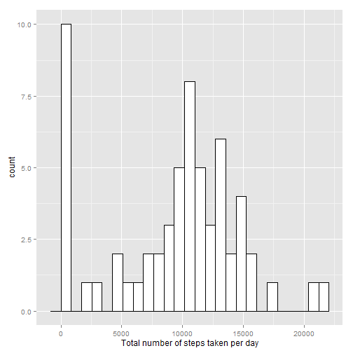
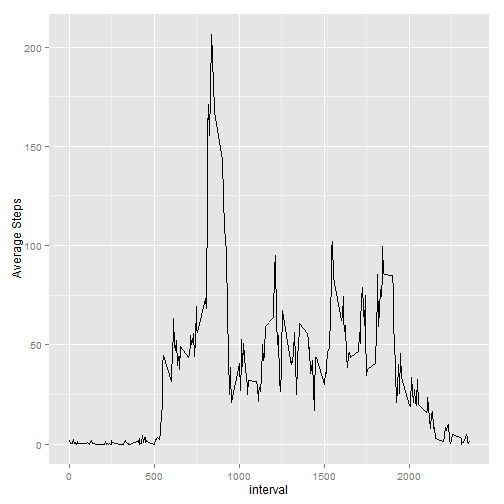
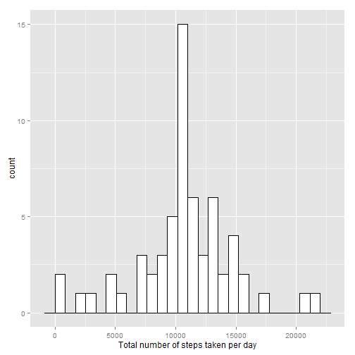
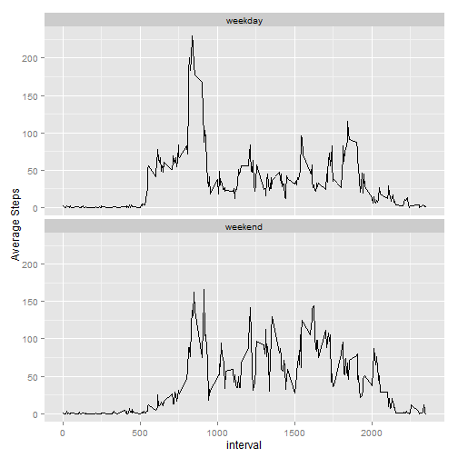

### Reproducible Research Peer Assignment 1 Report

This report answers the questions for Reproducible Research Peer Assignment 1. This assignment makes use of data from a personal activity monitoring device. This device collects data at 5 minute intervals through out the day. The data consists of two months of data from an anonymous individual collected during the months of October and November, 2012 and include the number of steps taken in 5 minute intervals each day.
Following are the detail of questions for each section and their supporting answers: 
#### Loading and Preprocessing data

- Loading required packages

```r
suppressPackageStartupMessages(c(library(ggplot2),
                               library(lubridate),
                               library(dplyr) ))
```

- The following unzips the datset and load the data in R for processing:

```r
unzip("activity.zip")
activity_data <- read.csv("activity.csv", colClasses = c("numeric","character","numeric"))
```

#### What is mean total number of steps taken per day?

- Total number of steps taken per day

```r
total_steps <- activity_data %>% 
        group_by(date) %>% 
        summarise(tot_steps = sum(steps,na.rm=T))
head(total_steps)
```

```
## Source: local data frame [6 x 2]
## 
##         date tot_steps
## 1 2012-10-01         0
## 2 2012-10-02       126
## 3 2012-10-03     11352
## 4 2012-10-04     12116
## 5 2012-10-05     13294
## 6 2012-10-06     15420
```

- Histogram of the total number of steps taken each day

```r
binsize <- diff(range(total_steps$tot_steps))/25
ggplot(total_steps,aes(x=tot_steps)) + geom_histogram(binwidth = binsize, 
fill ="white", colour = "black") + xlab("Total number of steps taken per day")
```

 

- Mean and median of the total number of steps taken per day

```r
mean_steps <- as.numeric(total_steps %>% 
                summarise(average = mean(tot_steps)))
mean_steps
```

```
## [1] 9354.23
```

```r
median_steps <- as.numeric(total_steps %>% 
                 summarise(average = median(tot_steps)))
median_steps
```

```
## [1] 10395
```

#### What is the average daily activity pattern?

- Make a time series plot (i.e. type = "l") of the 5-minute interval (x-axis) and the average number of steps taken, averaged across all days (y-axis)

```r
avg_interval <- activity_data %>% 
        group_by(interval) %>% 
        summarise(avg_step = mean(steps,na.rm=T))
ggplot(avg_interval, aes(interval,avg_step)) + geom_line() + ylab(" Average Steps")
```

 

- Which 5-minute interval, on average across all the days in the dataset, contains the maximum number of steps?

```r
max_interval <- as.numeric(avg_interval %>%  
                              arrange(desc(avg_step)) %>%
                              summarise(max_avg = first(interval)))
max_interval
```

```
## [1] 835
```

#### Imputing missing values

- Calculate and report the total number of missing values in the dataset (i.e. the total number of rows with NAs)

```r
missing_val <- length(which(!complete.cases(activity_data)))
missing_val
```

```
## [1] 2304
```

- Devise a strategy for filling in all of the missing values in the dataset. The strategy does not need to be sophisticated. For example, you could use the mean/median for that day, or the mean for that 5-minute interval, etc.

The missing step data will be filled with average steps for the corresposding interval

```r
new_activity_data <- inner_join(activity_data,avg_interval,by="interval") %>% 
        mutate(steps=ifelse(is.na(steps),avg_step,steps)) %>% 
        select(-4)
head(new_activity_data)
```

```
##       steps       date interval
## 1 1.7169811 2012-10-01        0
## 2 0.3396226 2012-10-01        5
## 3 0.1320755 2012-10-01       10
## 4 0.1509434 2012-10-01       15
## 5 0.0754717 2012-10-01       20
## 6 2.0943396 2012-10-01       25
```

- Make a histogram of the total number of steps taken each day and Calculate and report the mean and median total number of steps taken per day. Do these values differ from the estimates from the first part of the assignment? What is the impact of imputing missing data on the estimates of the total daily number of steps?

```r
total_steps_new <- new_activity_data %>% 
        group_by(date) %>% 
        summarise(tot_steps = sum(steps,na.rm=T))
head(total_steps_new)
```

```
## Source: local data frame [6 x 2]
## 
##         date tot_steps
## 1 2012-10-01  10766.19
## 2 2012-10-02    126.00
## 3 2012-10-03  11352.00
## 4 2012-10-04  12116.00
## 5 2012-10-05  13294.00
## 6 2012-10-06  15420.00
```

```r
binsz <- diff(range(total_steps_new$tot_steps))/25
ggplot(total_steps_new,aes(x=tot_steps)) + geom_histogram(binwidth = binsz, fill = "white", colour = "Black") + xlab("Total number of steps taken per day")
```

 

```r
mean_steps_new <- as.numeric(total_steps_new %>% 
                        summarise(average = mean(tot_steps)))
mean_steps_new
```

```
## [1] 10766.19
```

```r
median_steps_new <- as.numeric(total_steps_new %>% 
                        summarise(average = median(tot_steps)))
median_steps_new
```

```
## [1] 10766.19
```

The mean and median values have increased after filling in the missing values. The daily steps count has also increased for days where there were missing values.

#### Are there differences in activity patterns between weekdays and weekends?

- Create a new factor variable in the dataset with two levels - "weekday" and "weekend" indicating whether a given date is a weekday or weekend day.

```r
new_activity_data <- new_activity_data %>%
        transform(date=ymd(date)) %>% 
        mutate(day=ifelse(wday(date) %in% c(2:6),"weekday","weekend"))
```


- Make a panel plot containing a time series plot (i.e. type = "l") of the 5-minute interval (x-axis) and the average number of steps taken, averaged across all weekday days or weekend days (y-axis). 

```r
avg_data <- new_activity_data %>% 
        group_by(day,interval) %>% 
        summarise(avg = mean(steps)) 
ggplot(avg_data,aes(interval,avg)) + geom_line() + facet_wrap(~day, nrow=2) +ylab("Average Steps")
```

 

